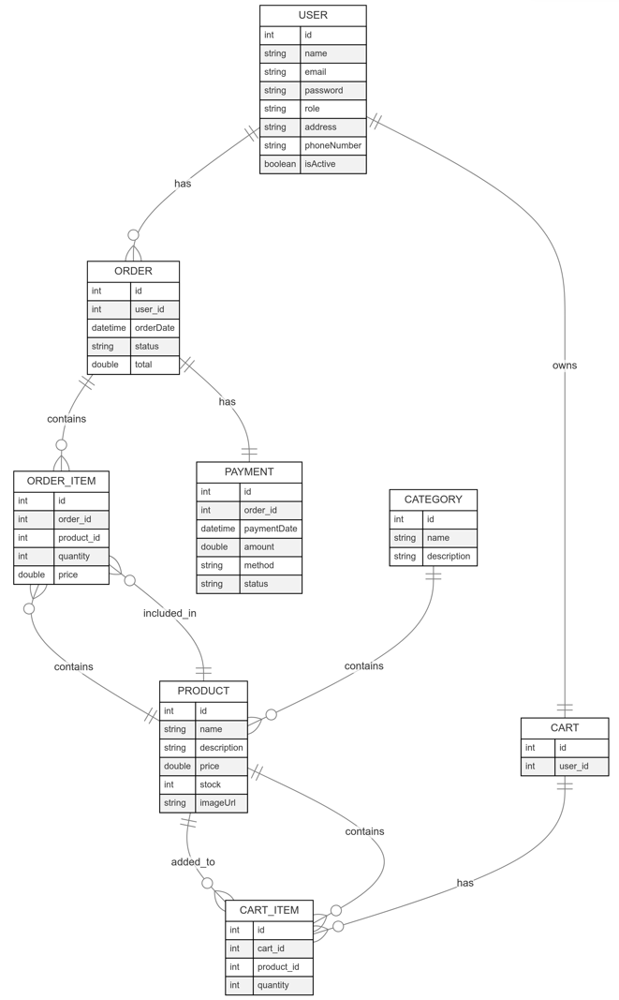

# Backend e-commerce (Java Spring)

Put here a brief description of the project

  
Content📝

  <ol>
    <li><a href="#objective">Objective</a></li>
    <li><a href="#deploy">Deploy</a></li>
    <li><a href="#stack">Stack</a></li>
    <li><a href="#diagram-db">Diagram</a></li>
    <li><a href="#local-installation">Installation</a></li>
    <li><a href="#endpoints">Endpoints</a></li>
    <li><a href="#future-functionalities">Future functionalities</a></li>
    <li><a href="#contributions">Contributions</a></li>
    <li><a href="#webography">Webography</a></li>
    <li><a href="#development">Development</a></li>
    <li><a href="#acknowledgments">Acknowledgments</a></li>
    <li><a href="#contact">Contact</a></li>
  </ol>

## Diagram DB

    erDiagram
    USER ||--o{ ORDER : has
    USER ||--|| CART : owns
    ORDER ||--o{ ORDER_ITEM : contains
    ORDER ||--|| PAYMENT : has
    PRODUCT ||--o{ ORDER_ITEM : included_in
    PRODUCT ||--o{ CART_ITEM : added_to
    CATEGORY ||--o{ PRODUCT : contains
    CART ||--o{ CART_ITEM : has
    CART_ITEM }o--|| PRODUCT : contains
    ORDER_ITEM }o--|| PRODUCT : contains
    
    USER {
        int id
        string name
        string email
        string password
        string role
        string address
        string phoneNumber
        boolean isActive
    }
    
    PRODUCT {
        int id
        string name
        string description
        double price
        int stock
        string imageUrl
    }
    
    CATEGORY {
        int id
        string name
        string description
    }
    
    CART {
        int id
        int user_id
    }
    
    CART_ITEM {
        int id
        int cart_id
        int product_id
        int quantity
    }
    
    ORDER {
        int id
        int user_id
        datetime orderDate
        string status
        double total
    }
    
    ORDER_ITEM {
        int id
        int order_id
        int product_id
        int quantity
        double price
    }
    
    PAYMENT {
        int id
        int order_id
        datetime paymentDate
        double amount
        string method
        string status
    }

